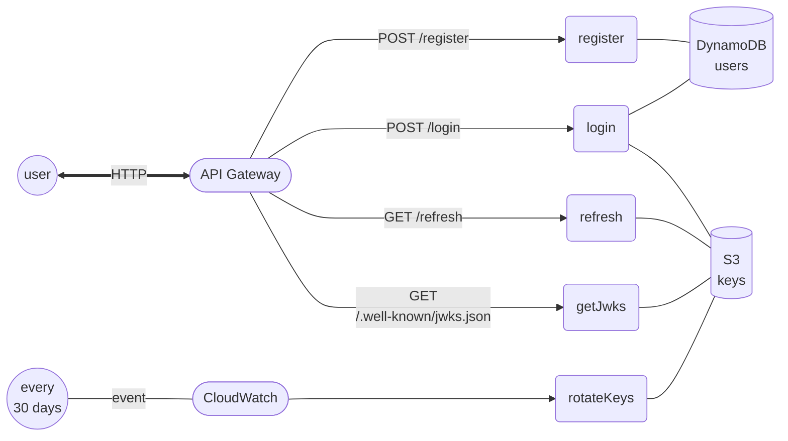

# Identeco

Minimalist authentication and authorization provider implemented using AWS lambda.

# Principal design



# Prereqs

Once stack is deployed the _keypair.pem_ and _jwks.json_ needs to be uploaded to the s3 bucket.

> **Note** this is no longer actuall the key rotation is happening periodically
> but it is still required to invoke rotateKeys once after deployment for the first rotation.

# How to deploy / remove

Deploy whole stack

```
sls deploy
sls invoke function -f rotateKeys
```

Currently the rotateKeys function needs to be triggered the first time in order to create the keys in s3 for the first time.

Remove whole stack

> **Note** manually remove all object from s3 bucket

```
sls remove
```

Deploy a single function (register)

```
sls deploy function -f register
```

# Features

- Registraion of username/password
- Using assymetric RS256 JWK algorithm
- Automatic keys rotation
- In jwks.json keeps the previous public key as well

# Known Issues and Limitations

- In case of errors it returns 500 status code (in some situations), but we want it to return some actual error code like 401, 400, etc
- _keypair.pem_ and _jwks.json_ needs to be pre-created and manually uploaded to s3 bucket
- Supports only authentication (username claim).
- No email confirmation
- No OpenID support

# Roadmap

## v0.1.0

- [x] Add dependencies for python tests
- [x] Replace API /rotate to cron-like scheduled event (CloudWatch?)
- [x] Replace require to EC6-style import
- [x] Move towards all-camelCase (currently trying to keep variables / json fields in a snake_case, while functions are camelCase)

## v0.1.1

- [ ] Implement CI/CD actions on pushes to main
- [ ] TBD
